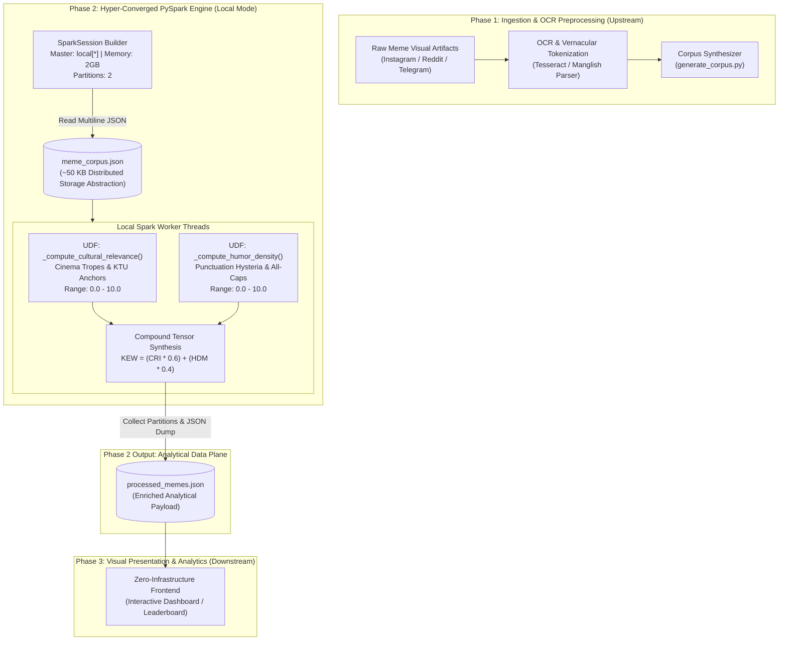

# PROJECT MASTER SUMMARY & SYSTEM COMPENDIUM
**Mallu Memes: Kerala Collective Psyche Distributed Processor & Vernacular Meme Analytics Platform**  
*Document Version:* `2.0.0-ENTERPRISE-DISTRIBUTED`  
*Last Synchronized:* September 2026  
*Status:* Active / Phase 2 PySpark Distributed Core Operational  

---

> [!IMPORTANT]
> **LIVING DOCUMENT DIRECTIVE (MANDATORY FOR ALL TEAMMATES)**:  
> This file is the **Single Source of Truth (SSOT)** for the entire repository. Whenever any engineer or agent adds, modifies, or refactors an execution script, scoring heuristic, schema definition, frontend component, or pipeline stage, **this file MUST be updated in the same commit/turn**. Keep every section synchronized so cross-functional teammates (Data Engineering, NLP, Frontend, QA) can build without discrepancies.

---

## TABLE OF CONTENTS
1. [Project Mission, Vernacular Philosophy & Architectural Invariants](#1-project-mission-vernacular-philosophy--architectural-invariants)
2. [High-Level System Topology & Distributed Architecture](#2-high-level-system-topology--distributed-architecture)
3. [Repository Inventory — File & Directory Map](#3-repository-inventory--file--directory-map)
4. [What Has Been Done So Far (Milestones & Changelog)](#4-what-has-been-done-so-far-milestones--changelog)
5. [Proprietary Scoring Algorithms & Mathematical Formulations](#5-proprietary-scoring-algorithms--mathematical-formulations)
6. [Data Schemas & Payload Contracts](#6-data-schemas--payload-contracts)
7. [Infrastructure & Distributed Runtime Specifications](#7-infrastructure--distributed-runtime-specifications)
8. [Developer Quickstart & Execution Runbook](#8-developer-quickstart--execution-runbook)
9. [Downstream Roadmap & Future Phases](#9-downstream-roadmap--future-phases)

---

## 1. PROJECT MISSION, VERNACULAR PHILOSOPHY & ARCHITECTURAL INVARIANTS

The **Mallu Memes Analytics Platform** is an enterprise-grade vernacular cultural intelligence and sentiment analysis system designed to quantify the existential absurdities of Malayalam internet culture.

By intentionally utilizing Apache Spark in local mode to process a ~50 KB JSON payload, the architecture achieves **maximum architectural pretentiousness**—bringing distributed compute paradigms intended for multi-petabyte data lakes down to a single laptop core.

### The 4 Inviolable Architectural Invariants

1. **Distributed Compute for Vernacular Artifacts**:
   - Every raw OCR text extracted from Malayalam social media memes must undergo distributed transformation via Apache Spark (`pyspark.sql`).
   - Ingestion utilizes multiline JSON partition readers, and metric evaluation is executed through custom vectorized Spark User-Defined Functions (UDFs).
2. **Deterministic Cultural Quantification**:
   - Satire, cinematic archetypes (Mohanlal, Mammootty, Salim Kumar, Jagathy Sreekumar, Harisree Ashokan), and societal anxieties (KTU supplementary exam trauma, hartals, theppu) are codified into weighted anchor vectors.
   - Every meme must resolve into a deterministic triad of scores:
     - `cultural_relevance_index` $\in [0.0, 10.0]$
     - `humor_density_metric` $\in [0.0, 10.0]$
     - `kerala_existential_weight` $\in [0.0, 10.0]$
3. **Environment Resilience & Windows Self-Healing**:
   - Distributed Java runtime dependencies (JDK 17 LTS) must be guaranteed with automatic environment discovery.
   - If `JAVA_HOME` is unpopulated in the active shell, the pipeline automatically detects standard Microsoft OpenJDK / Adoptium installation paths, eliminating manual environment configuration friction.
4. **Zero-Infrastructure Local Portability**:
   - The primary output (`processed_memes.json`) is packaged as a high-density, low-latency JSON analytical payload ready for direct consumption by web frontends (Next.js / Vite / React) without requiring cloud database hosting.

---

## 2. HIGH-LEVEL SYSTEM TOPOLOGY & DISTRIBUTED ARCHITECTURE



---

## 3. REPOSITORY INVENTORY — FILE & DIRECTORY MAP

```
mallu-memes/
├── .agents/
│   └── rules/
│       └── sync-master-summary.md          # Automation rule enforcing SSOT synchronization
├── .gitignore                              # Comprehensive exclusions (venv, caches, artifacts)
├── .venv/                                  # Isolated Python 3.11 virtual environment
├── LICENSE                                 # MIT Open Source License
├── README.md                               # Project intro & vernacular manifest
├── generate_corpus.py                      # Synthetic corpus synthesizer (~50 KB test payload)
├── meme_corpus.json                        # Phase 1 output / Phase 2 distributed input corpus
├── phase2_pyspark_pipeline.py              # Phase 2 Distributed PySpark Compute Engine
├── processed_memes.json                    # Phase 2 output analytical payload with metrics
├── PROJECT_MASTER_SUMMARY.md               # [THIS FILE] Single Source of Truth Compendium
└── requirements.txt                        # Pinned dependencies (pyspark, py4j)
```

### Detailed Component Inventory

| File / Component | Primary Technology | Purpose & Responsibility |
| :--- | :--- | :--- |
| `phase2_pyspark_pipeline.py` | Python 3.11, PySpark 4.2.0 | Core distributed compute engine (`KeralaDistributedMemeComputeEngine`). Builds SparkSession in `local[*]`, registers custom UDFs, transforms dataframe, and outputs `processed_memes.json`. |
| `generate_corpus.py` | Python 3.11, `json`, `random` | Generates 85+ authentic vernacular meme records (~50 KB) featuring iconic Malayalam tropes, dialogue excerpts, engagement metrics, and distributed shard IDs. |
| `meme_corpus.json` | JSON Schema | Ingestion corpus containing raw meme titles, OCR texts, categories, characters, movies, and distributed shard metadata. |
| `processed_memes.json` | JSON Schema | Enriched output containing all original metadata plus computed `cultural_relevance_index`, `humor_density_metric`, and `kerala_existential_weight`. |
| `requirements.txt` | Pip | Reproducible Python environment pinning (`pyspark==4.2.0`, `py4j==0.10.9.9`). |
| `.agents/rules/sync-master-summary.md` | Agentic Workflow Rule | Enforces that any modification or feature addition to the repository immediately updates this compendium. |

---

## 4. WHAT HAS BEEN DONE SO FAR (MILESTONES & CHANGELOG)

### Milestone 1: Distributed Infrastructure Provisioning (September 2026)
- **Microsoft OpenJDK 17 LTS Installed**: Provisioned through `winget` (`Microsoft.OpenJDK.17` version `17.0.20.101`). Permanent system `JAVA_HOME` configured at `C:\Program Files\Microsoft\jdk-17.0.20.101-hotspot\` with JVM binaries in system `Path`.
- **Isolated Virtual Environment**: Created `.venv`, upgraded pip, and installed `pyspark 4.2.0` and `py4j 0.10.9.9`.

### Milestone 2: Phase 2 PySpark Distributed Pipeline Implementation
- **Script Creation (`phase2_pyspark_pipeline.py`)**: Built `KeralaDistributedMemeComputeEngine` with:
  - Spark cluster configuration (`appName="KeralaCollectivePsycheDistributedProcessor"`, `master="local[*]"`, `spark.driver.memory="2g"`, `spark.sql.shuffle.partitions="2"`).
  - JVM log suppression (`setLogLevel("ERROR")`).
  - Windows environment resilience fallback (automatic `JAVA_HOME` detection if omitted from parent process).
  - Vectorized Spark UDFs for cultural relevance and humor density.
  - Multi-column tensor calculation for overall existential weight.

### Milestone 3: Vernacular Corpus Generation & Pipeline Validation
- **Corpus Synthesis (`generate_corpus.py`)**: Built 85 distributed records (49.66 KB payload) capturing iconic tropes (*Dashamoolam Damu, Manavalan, CID Moosa, Ramanathan in Punjabi House, Jagathy in Yodha, KTU supply trauma, midnight thattukada beef & porotta, hartal announcements*).
- **End-to-End Spark Execution**: Executed `phase2_pyspark_pipeline.py` successfully on local Spark cluster. Persisted 85 scored records to `processed_memes.json`.
- **Git Version Control**: Committed and pushed all Phase 2 assets to `origin/main` (`commit 92fb7fc`).

---

## 5. PROPRIETARY SCORING ALGORITHMS & MATHEMATICAL FORMULATIONS

### 1. Cultural Relevance Index ($CRI$)
Quantifies the cultural resonance of the meme against the shared consciousness of Kerala cinema, political discourse, and regional academic struggles.

$$\text{CRI}(\text{text}) = \min\left( \sum_{k \in \mathcal{A}} w_k \cdot \mathbb{I}(k \in \text{lower}(\text{text})), \; 10.0 \right)$$

Where $\mathcal{A}$ is the Sacred Anchor Vocabulary:

| Anchor Keyword | Weight ($w_k$) | Cultural Significance & Context |
| :--- | :---: | :--- |
| `dashamoolam` | **3.0** | Suraj Venjaramoodu in *Chattambinadu* (Ultimate comedy antagonist archetype) |
| `salim kumar` | **3.0** | National Award-winning comedic luminary & dialogue icon |
| `jagathy` | **3.0** | Jagathy Sreekumar (Uncontested king of expressive Malayalam slapstick & satire) |
| `ktu` | **3.0** | APJ Abdul Kalam Technological University (Apex source of engineering student trauma) |
| `damu` | **2.5** | Diminutive for Dashamoolam Damu, universal synonym for failed schemes |
| `manavalan` | **2.5** | Salim Kumar's legendary foreign-return entrepreneur persona in *Pulival Kalyanam* |
| `cid moosa` | **2.5** | Dileep & Johny Antony's quintessential slapstick detective masterpiece |
| `supply` | **2.5** | Academic supplementary examination (BTech backlog trauma) |
| `harisree` | **2.0** | Harisree Ashokan (Pivotal comic foil) |
| `ramanathan` | **2.0** | Legendary deaf/mute impostor persona from *Punjabi House* ("Ayyo Ramanathan!") |
| `theppu` | **2.0** | Vernacular colloquialism for betrayal / unrequited romantic dumping |
| `hartal` | **2.0** | Kerala's traditional day of involuntary statewide rest & shuttered commerce |
| `pinarayi` | **2.0** | Chief Minister political reference / press conference punchlines |
| `sadhanam` | **2.0** | Iconic dialogue reference (*"Sadhanam kayyil undo?"*) |
| `scene` | **1.5** | State of critical emotional distress or chaotic escalation (*"Scene contra!"*) |
| `mwone` | **1.5** | Endearing vernacular address (*"Mwone Dinesha"*) |
| `porotta` | **1.5** | Malabar layered flatbread (Cultural dietary pillar) |
| `beef` | **1.5** | Traditional accompaniment to porotta (Culinary heritage) |
| `bjp` | **1.5** | Political entity in Kerala tripartite electoral discourse |
| `congress` | **1.5** | Political entity in Kerala tripartite electoral discourse |
| `chalu` | **1.5** | Intentional bad joke or cringe humor trope |
| `adipoli` | **1.0** | Universal Malayalam expression of enthusiastic approval |
| `chaya` | **1.0** | Kerala tea shop (*thattukada*) beverage & social catalyst |
| `kambi` | **1.0** | Vernacular pulp fiction / double entendre reference |

---

### 2. Humor Density Metric ($HDM$)
Quantifies the chaotic comedic energy through non-linear heuristics evaluating punctuational distress, phonetic Manglish laughter, and capitalization rage.

$$\text{HDM}(\text{text}) = \min\left( 1.0 + \Delta_{\text{punc}} + \Delta_{\text{laughter}} + \Delta_{\text{caps}}, \; 10.0 \right)$$

Where:
- **Punctuation Hysteria ($\Delta_{\text{punc}}$)**:
  $$\Delta_{\text{punc}} = \min\left( N_{[!?.]} \times 0.4, \; 3.0 \right)$$
- **Phonetic Laughter Patterns ($\Delta_{\text{laughter}}$)**:
  Detects regex matches for `(haha|hehe|chiri|eda|entho|ayyo|enthina)`:
  $$\Delta_{\text{laughter}} = \min\left( N_{\text{patterns}} \times 1.5, \; 4.0 \right)$$
- **All-Caps Shout Energy ($\Delta_{\text{caps}}$)**:
  $$\Delta_{\text{caps}} = \begin{cases} 2.0 & \text{if } \frac{N_{\text{uppercase}}}{L_{\text{text}}} > 0.3 \\ 0.0 & \text{otherwise} \end{cases}$$

---

### 3. Kerala Existential Weight ($KEW$)
Harmonic weighted synthesis fusing cultural depth ($60\%$) with raw comedic hysteria ($40\%$):

$$\text{KEW} = 0.6 \times \text{CRI} + 0.4 \times \text{HDM}$$

---

## 6. DATA SCHEMAS & PAYLOAD CONTRACTS

### Ingestion Contract: `meme_corpus.json`
```json
[
  {
    "meme_id": "MEME_001",
    "title": "Dashamoolam Damu Police Station Breakdown",
    "character": "Dashamoolam Damu",
    "movie": "Chattambinadu",
    "raw_ocr_text": "Dashamoolam Damu: Athu pinne sir... njan oru simple quotation eduthatha! Sadhanam kayyilundo mwone?! HAHAHA AYYO SCENE! Salim Kumar reaction epic!",
    "year": 2009,
    "category": "Classic Quotation",
    "engagement_score": 32667.61,
    "shares_count": 967,
    "troll_page_handle": "@troll_malayalam_node_0",
    "cloud_distributed_shard_id": "shard_asia_south_kerala_0"
  }
]
```

### Analytical Contract: `processed_memes.json`
```json
[
  {
    "meme_id": "MEME_001",
    "title": "Dashamoolam Damu Police Station Breakdown",
    "character": "Dashamoolam Damu",
    "movie": "Chattambinadu",
    "raw_ocr_text": "Dashamoolam Damu: Athu pinne sir... njan oru simple quotation eduthatha! Sadhanam kayyilundo mwone?! HAHAHA AYYO SCENE! Salim Kumar reaction epic!",
    "year": 2009,
    "category": "Classic Quotation",
    "engagement_score": 32667.61,
    "shares_count": 967,
    "troll_page_handle": "@troll_malayalam_node_0",
    "cloud_distributed_shard_id": "shard_asia_south_kerala_0",
    "cultural_relevance_index": 10.0,
    "humor_density_metric": 7.0,
    "kerala_existential_weight": 8.8
  }
]
```

---

## 7. INFRASTRUCTURE & DISTRIBUTED RUNTIME SPECIFICATIONS

### Distributed Runtime Prerequisites
- **Java Virtual Machine**: OpenJDK 17 LTS (Microsoft Build `17.0.20.1+1-LTS` x64).
  - Registry / Install Directory: `C:\Program Files\Microsoft\jdk-17.0.20.101-hotspot`
  - Required Environment Variable: `JAVA_HOME` pointing to base directory.
- **Python Execution Environment**: Python 3.11+ in isolated virtual environment (`.venv`).
- **Core Libraries**:
  - `pyspark==4.2.0`
  - `py4j==0.10.9.9`

### Spark Cluster Configuration Parameters
```python
SparkSession.builder \
    .appName("KeralaCollectivePsycheDistributedProcessor") \
    .master("local[*]") \
    .config("spark.driver.memory", "2g") \
    .config("spark.sql.shuffle.partitions", "2") \
    .getOrCreate()
```

---

## 8. DEVELOPER QUICKSTART & EXECUTION RUNBOOK

### 1. Activating the Environment
```powershell
# From the repository root:
.venv\Scripts\Activate.ps1
```

### 2. Synthesizing / Refreshing the Corpus
```powershell
.venv\Scripts\python.exe generate_corpus.py
# Output: Generated meme_corpus.json with 85 records, payload size: ~50 KB
```

### 3. Executing the PySpark Distributed Pipeline
```powershell
.venv\Scripts\python.exe phase2_pyspark_pipeline.py
```
**Expected Console Telemetry:**
```text
[INIT] Allocating hyper-converged Spark execution nodes...
[STAGE 1] Ingesting schema from distributed storage abstraction: meme_corpus.json
[STAGE 2] Executing distributed matrix transformations across worker threads...
[STAGE 3] Collecting distributed partitions into low-latency analytical payload...
[SUCCESS] Distributed computation resolved. Persisted 85 transformed records to processed_memes.json.
```

---

## 9. DOWNSTREAM ROADMAP & FUTURE PHASES

1. **Phase 1 Pipeline Formalization (OCR & Crawler)**:
   - Integrate Tesseract OCR & OpenCV for direct image-to-text extraction from Malayalam meme JPEG/PNG files.
   - Manglish tokenization using Malayalam phonetic transliteration lexicons.
2. **Phase 3: High-Aesthetic Vernacular Web Dashboard**:
   - Build an interactive web frontend (Vite + React / TailwindCSS) with dark mode, glassmorphism cards, and live filtering.
   - Leaderboards for "Most Existentially Heavy Memes" ($KEW \ge 9.0$).
   - Interactive radar charts comparing Cultural Relevance vs. Humor Density across different cinematic characters (Damu vs. Manavalan vs. Jagathy).
3. **Phase 4: Real-Time Streaming Ingestion**:
   - Spark Structured Streaming integration to score live social media posts in real-time.
