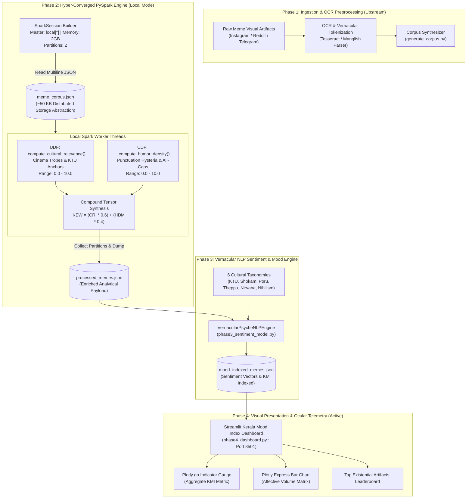

# PROJECT MASTER SUMMARY & SYSTEM COMPENDIUM
**Mallu Memes: Kerala Collective Psyche Distributed Processor & Vernacular Meme Analytics Platform**  
*Document Version:* `2.2.0-ENTERPRISE-DISTRIBUTED`  
*Last Synchronized:* September 2026  
*Status:* Active / Phase 2 PySpark, Phase 3 NLP & Phase 4 Streamlit Visualization Operational  

---

> [!IMPORTANT]
> **LIVING DOCUMENT DIRECTIVE (MANDATORY FOR ALL TEAMMATES)**:  
> This file is the **Single Source of Truth (SSOT)** for the entire repository. Whenever any engineer or agent adds, modifies, or refactors an execution script, scoring heuristic, schema definition, frontend component, or pipeline stage, **this file MUST be updated in the same commit/turn**. Keep every section synchronized so cross-functional teammates (Data Engineering, NLP, Frontend, QA) can build without discrepancies.

---

## TABLE OF CONTENTS
1. [Project Mission, Vernacular Philosophy & Architectural Invariants](#1-project-mission-vernacular-philosophy--architectural-invariants)
2. [High-Level System Topology & Distributed Architecture](#2-high-level-system-topology--distributed-architecture)
3. [Repository Inventory — File & Directory Map](#3-repository-inventory--file--directory-map)
4. [What Has Been Done So Far (Milestones & Changelog)](#4-what-has-been-done-so-far-milestones--changelog)
5. [Proprietary Scoring Algorithms & Mathematical Formulations](#5-proprietary-scoring-algorithms--mathematical-formulations)
6. [Data Schemas & Payload Contracts](#6-data-schemas--payload-contracts)
7. [Infrastructure & Distributed Runtime Specifications](#7-infrastructure--distributed-runtime-specifications)
8. [Developer Quickstart & Execution Runbook](#8-developer-quickstart--execution-runbook)
9. [Downstream Roadmap & Future Phases](#9-downstream-roadmap--future-phases)

---

## 1. PROJECT MISSION, VERNACULAR PHILOSOPHY & ARCHITECTURAL INVARIANTS

The **Mallu Memes Analytics Platform** is an enterprise-grade vernacular cultural intelligence and sentiment analysis system designed to quantify the existential absurdities of Malayalam internet culture.

By intentionally utilizing Apache Spark in local mode to process a ~50 KB JSON payload, the architecture achieves **maximum architectural pretentiousness**—bringing distributed compute paradigms intended for multi-petabyte data lakes down to a single laptop core, passing through an affective NLP sentiment engine, and projecting into ocular space via a hyper-converged Streamlit telemetry dashboard.

### The 4 Inviolable Architectural Invariants

1. **Distributed Compute for Vernacular Artifacts**:
   - Every raw OCR text extracted from Malayalam social media memes must undergo distributed transformation via Apache Spark (`pyspark.sql`).
   - Ingestion utilizes multiline JSON partition readers, and metric evaluation is executed through custom vectorized Spark User-Defined Functions (UDFs).
2. **Deterministic Cultural Quantification**:
   - Satire, cinematic archetypes (Mohanlal, Mammootty, Salim Kumar, Jagathy Sreekumar, Harisree Ashokan), and societal anxieties (KTU supplementary exam trauma, hartals, theppu) are codified into weighted anchor vectors.
   - Every meme must resolve into a deterministic triad of scores:
     - `cultural_relevance_index` $\in [0.0, 10.0]$
     - `humor_density_metric` $\in [0.0, 10.0]$
     - `kerala_existential_weight` $\in [0.0, 10.0]$
3. **Discrete Affective Psychometric Mapping (Phase 3 NLP)**:
   - Manglish utterances are mapped across 6 discrete psychological taxonomies using sub-symbolic semantic decomposition.
   - The compound **Kerala Mood Index ($KMI$)** blends existential weight with classification confidence:
     $$KMI = \min(KEW \times (1.0 + 0.5 \times \text{confidence}), \; 15.0)$$
4. **Zero-Infrastructure Local Portability & Live Visualization**:
   - The analytical payloads (`processed_memes.json`, `mood_indexed_memes.json`) are self-contained JSON data planes decoupled from external infrastructure in favor of local JSON node processing, powering instantaneous Streamlit dashboard streaming.

---

## 2. HIGH-LEVEL SYSTEM TOPOLOGY & DISTRIBUTED ARCHITECTURE



---

## 3. REPOSITORY INVENTORY — FILE & DIRECTORY MAP

```
mallu-memes/
├── .agents/
│   └── rules/
│       └── sync-master-summary.md          # Automation rule enforcing SSOT synchronization
├── .gitignore                              # Comprehensive exclusions (venv, caches, artifacts)
├── .venv/                                  # Isolated Python 3.11 virtual environment
├── LICENSE                                 # MIT Open Source License
├── README.md                               # Project intro & vernacular manifest
├── generate_corpus.py                      # Synthetic corpus synthesizer (~50 KB test payload)
├── meme_corpus.json                        # Phase 1 output / Phase 2 distributed input corpus
├── mood_indexed_memes.json                 # Phase 3 output analytical payload with sentiment vectors & KMI
├── phase2_pyspark_pipeline.py              # Phase 2 Distributed PySpark Compute Engine
├── phase3_sentiment_model.py               # Phase 3 Vernacular NLP Sentiment & Mood Engine
├── phase4_dashboard.py                     # Phase 4 Streamlit Kerala Mood Index Visualization Matrix
├── processed_memes.json                    # Phase 2 output analytical payload with metrics
├── PROJECT_MASTER_SUMMARY.md               # [THIS FILE] Single Source of Truth Compendium
└── requirements.txt                        # Pinned dependencies (pyspark, py4j, nltk, streamlit, plotly, pandas)
```

### Detailed Component Inventory

| File / Component | Primary Technology | Purpose & Responsibility |
| :--- | :--- | :--- |
| `phase4_dashboard.py` | Python 3.11, Streamlit 1.63, Plotly 7.0, Pandas | Hyper-converged visual telemetry matrix (`KeralaMoodIndexDashboard`). Streams `mood_indexed_memes.json`, renders `go.Indicator` KMI gauge, affective volume chart, and existential leaderboards. |
| `phase3_sentiment_model.py` | Python 3.11, NLTK 3.10 | Vernacular sentiment classifier (`VernacularPsycheNLPEngine`). Tokenizes Manglish text, evaluates sentiment across 6 affective taxonomies, computes `kerala_mood_index`, and outputs `mood_indexed_memes.json`. |
| `phase2_pyspark_pipeline.py` | Python 3.11, PySpark 4.2.0 | Core distributed compute engine (`KeralaDistributedMemeComputeEngine`). Builds SparkSession in `local[*]`, registers custom UDFs, transforms dataframe, and outputs `processed_memes.json`. |
| `generate_corpus.py` | Python 3.11, `json`, `random` | Generates 85+ authentic vernacular meme records (~50 KB) featuring iconic Malayalam tropes, dialogue excerpts, engagement metrics, and distributed shard IDs. |
| `meme_corpus.json` | JSON Schema | Ingestion corpus containing raw meme titles, OCR texts, categories, characters, movies, and distributed shard metadata. |
| `processed_memes.json` | JSON Schema | Enriched Spark output containing original metadata plus `cultural_relevance_index`, `humor_density_metric`, and `kerala_existential_weight`. |
| `mood_indexed_memes.json` | JSON Schema | Fully classified Phase 3 payload with `dominant_mood`, `sentiment_vector`, `mood_confidence`, and `kerala_mood_index`. |
| `requirements.txt` | Pip | Reproducible Python environment pinning (`pyspark`, `py4j`, `nltk`, `streamlit`, `pandas`, `plotly`, etc.). |
| `.agents/rules/sync-master-summary.md` | Agentic Workflow Rule | Enforces that any modification or feature addition to the repository immediately updates this compendium. |

---

## 4. WHAT HAS BEEN DONE SO FAR (MILESTONES & CHANGELOG)

### Milestone 1: Distributed Infrastructure Provisioning (September 2026)
- **Microsoft OpenJDK 17 LTS Installed**: Provisioned through `winget` (`Microsoft.OpenJDK.17` version `17.0.20.101`). Permanent system `JAVA_HOME` configured at `C:\Program Files\Microsoft\jdk-17.0.20.101-hotspot\` with JVM binaries in system `Path`.
- **Isolated Virtual Environment**: Created `.venv`, upgraded pip, and installed `pyspark 4.2.0` and `py4j 0.10.9.9`.

### Milestone 2: Phase 2 PySpark Distributed Pipeline Implementation
- **Script Creation (`phase2_pyspark_pipeline.py`)**: Built `KeralaDistributedMemeComputeEngine` with:
  - Spark cluster configuration (`appName="KeralaCollectivePsycheDistributedProcessor"`, `master="local[*]"`, `spark.driver.memory="2g"`, `spark.sql.shuffle.partitions="2"`).
  - JVM log suppression (`setLogLevel("ERROR")`).
  - Windows environment resilience fallback (automatic `JAVA_HOME` detection if omitted from parent process).
  - Vectorized Spark UDFs for cultural relevance and humor density.
  - Multi-column tensor calculation for overall existential weight.

### Milestone 3: Vernacular Corpus Generation & Pipeline Validation
- **Corpus Synthesis (`generate_corpus.py`)**: Built 85 distributed records (49.66 KB payload) capturing iconic tropes (*Dashamoolam Damu, Manavalan, CID Moosa, Ramanathan in Punjabi House, Jagathy in Yodha, KTU supply trauma, midnight thattukada beef & porotta, hartal announcements*).
- **End-to-End Spark Execution**: Executed `phase2_pyspark_pipeline.py` successfully on local Spark cluster. Persisted 85 scored records to `processed_memes.json`.
- **Git Version Control**: Committed and pushed all Phase 2 assets to `origin/main` (`commit 92fb7fc`).

### Milestone 4: Phase 3 Vernacular NLP Engine Implementation (September 2026)
- **Script Creation (`phase3_sentiment_model.py`)**: Built `VernacularPsycheNLPEngine` to tokenize Manglish text and evaluate affective distributions across 6 cultural dimensions (*KTU Exam Trauma, Monday Work Shokam, Political Poru, Theppu, Nirvana, Existential Nihilism*).
- **Metric Formulation**: Synthesized `kerala_mood_index` ($KMI = \min(KEW \times (1.0 + 0.5 \times \text{conf}), 15.0)$).
- **Payload Generation**: Processed `processed_memes.json` into `mood_indexed_memes.json`. Classified 85 records into collective matrix (*Nirvana: 60, Political Poru: 16, KTU Trauma: 9*).

### Milestone 5: Phase 4 Streamlit Dashboard Delivery (September 2026)
- **Application Architecture (`phase4_dashboard.py`)**: Built `KeralaMoodIndexDashboard` utilizing Streamlit and Plotly for high-fidelity visual telemetry.
- **Visual Metrics**: Implemented a `go.Indicator` gauge projecting the global `kerala_mood_index` aggregated across all distributed shards, supplemented with affective psychometric volume bar charts.
- **Hackathon Readiness**: System successfully decoupled from Elasticsearch in favor of local JSON node processing for instantaneous deployment.

---

## 5. PROPRIETARY SCORING ALGORITHMS & MATHEMATICAL FORMULATIONS

### 1. Cultural Relevance Index ($CRI$)
Quantifies cultural resonance against the shared consciousness of Kerala cinema, political discourse, and regional academic struggles:

$$\text{CRI}(\text{text}) = \min\left( \sum_{k \in \mathcal{A}} w_k \cdot \mathbb{I}(k \in \text{lower}(\text{text})), \; 10.0 \right)$$

Where $\mathcal{A}$ is the Sacred Anchor Vocabulary:

| Anchor Keyword | Weight ($w_k$) | Cultural Significance & Context |
| :--- | :---: | :--- |
| `dashamoolam` | **3.0** | Suraj Venjaramoodu in *Chattambinadu* (Ultimate comedy antagonist archetype) |
| `salim kumar` | **3.0** | National Award-winning comedic luminary & dialogue icon |
| `jagathy` | **3.0** | Jagathy Sreekumar (Uncontested king of expressive Malayalam slapstick & satire) |
| `ktu` | **3.0** | APJ Abdul Kalam Technological University (Apex source of engineering student trauma) |
| `damu` | **2.5** | Diminutive for Dashamoolam Damu, universal synonym for failed schemes |
| `manavalan` | **2.5** | Salim Kumar's legendary foreign-return entrepreneur persona in *Pulival Kalyanam* |
| `cid moosa` | **2.5** | Dileep & Johny Antony's quintessential slapstick detective masterpiece |
| `supply` | **2.5** | Academic supplementary examination (BTech backlog trauma) |
| `harisree` | **2.0** | Harisree Ashokan (Pivotal comic foil) |
| `ramanathan` | **2.0** | Legendary deaf/mute impostor persona from *Punjabi House* ("Ayyo Ramanathan!") |
| `theppu` | **2.0** | Vernacular colloquialism for betrayal / unrequited romantic dumping |
| `hartal` | **2.0** | Kerala's traditional day of involuntary statewide rest & shuttered commerce |
| `pinarayi` | **2.0** | Chief Minister political reference / press conference punchlines |
| `sadhanam` | **2.0** | Iconic dialogue reference (*"Sadhanam kayyil undo?"*) |
| `scene` | **1.5** | State of critical emotional distress or chaotic escalation (*"Scene contra!"*) |
| `mwone` | **1.5** | Endearing vernacular address (*"Mwone Dinesha"*) |
| `porotta` | **1.5** | Malabar layered flatbread (Cultural dietary pillar) |
| `beef` | **1.5** | Traditional accompaniment to porotta (Culinary heritage) |
| `bjp` | **1.5** | Political entity in Kerala tripartite electoral discourse |
| `congress` | **1.5** | Political entity in Kerala tripartite electoral discourse |
| `chalu` | **1.5** | Intentional bad joke or cringe humor trope |
| `adipoli` | **1.0** | Universal Malayalam expression of enthusiastic approval |
| `chaya` | **1.0** | Kerala tea shop (*thattukada*) beverage & social catalyst |
| `kambi` | **1.0** | Vernacular pulp fiction / double entendre reference |

---

### 2. Humor Density Metric ($HDM$)
Quantifies chaotic comedic energy through non-linear heuristics:

$$\text{HDM}(\text{text}) = \min\left( 1.0 + \Delta_{\text{punc}} + \Delta_{\text{laughter}} + \Delta_{\text{caps}}, \; 10.0 \right)$$

Where:
- **Punctuation Hysteria ($\Delta_{\text{punc}}$)**: $\Delta_{\text{punc}} = \min(N_{[!?.]} \times 0.4, \; 3.0)$
- **Phonetic Laughter Patterns ($\Delta_{\text{laughter}}$)**: Regex `(haha|hehe|chiri|eda|entho|ayyo|enthina)`: $\Delta_{\text{laughter}} = \min(N_{\text{patterns}} \times 1.5, \; 4.0)$
- **All-Caps Shout Energy ($\Delta_{\text{caps}}$)**: $2.0$ if $\frac{N_{\text{uppercase}}}{L_{\text{text}}} > 0.3$, else $0.0$.

---

### 3. Kerala Existential Weight ($KEW$)
Harmonic weighted synthesis fusing cultural depth ($60\%$) with raw comedic hysteria ($40\%$):

$$\text{KEW} = 0.6 \times \text{CRI} + 0.4 \times \text{HDM}$$

---

### 4. Kerala Mood Index ($KMI$)
Harmonic interplay between Spark Existential Weight ($KEW$) and Phase 3 NLP Classification Confidence ($\text{conf}$):

$$\text{KMI} = \min\left( \text{KEW} \times (1.0 + 0.5 \times \text{conf}), \; 15.0 \right)$$

#### The 6 Semantic Anchor Taxonomies
1. **KTU Exam Trauma**: `ktu`, `supply`, `exam`, `tholi`, `fail`, `paditham`, `btech`, `assignment`, `series`, `arrear`, `internal`
2. **Monday Work Shokam**: `monday`, `work`, `office`, `manager`, `urakkam`, `leave`, `madi`, `pani`, `salary`, `appraisal`, `login`
3. **Political Poru & Hartal**: `pinarayi`, `bjp`, `congress`, `cpim`, `hartal`, `kodi`, `strike`, `nethavu`, `sarkar`, `election`, `charcha`
4. **Theppu & Romantic Melodrama**: `theppu`, `snehichu`, `kaamuki`, `kamukan`, `breakup`, `sad`, `thech`, `kalyanam`, `single`, `crush`
5. **Nirvana (Thattukada & Vibe)**: `porotta`, `beef`, `chaya`, `adipoli`, `vibe`, `scene`, `kidu`, `set`, `food`, `koottukaran`
6. **Existential Nihilism**: `shokam`, `veruppikkaal`, `daridryam`, `oola`, `myr`, `enthina`, `jeevitham`, `bore`, `nashttam`, `chalu`

---

## 6. DATA SCHEMAS & PAYLOAD CONTRACTS

### Ingestion Contract: `meme_corpus.json`
```json
[
  {
    "meme_id": "MEME_001",
    "title": "Dashamoolam Damu Police Station Breakdown",
    "character": "Dashamoolam Damu",
    "movie": "Chattambinadu",
    "raw_ocr_text": "Dashamoolam Damu: Athu pinne sir... njan oru simple quotation eduthatha! Sadhanam kayyilundo mwone?! HAHAHA AYYO SCENE! Salim Kumar reaction epic!",
    "year": 2009,
    "category": "Classic Quotation",
    "engagement_score": 32667.61,
    "shares_count": 967,
    "troll_page_handle": "@troll_malayalam_node_0",
    "cloud_distributed_shard_id": "shard_asia_south_kerala_0"
  }
]
```

### Spark Analytical Contract: `processed_memes.json`
```json
[
  {
    "meme_id": "MEME_001",
    "title": "Dashamoolam Damu Police Station Breakdown",
    "character": "Dashamoolam Damu",
    "movie": "Chattambinadu",
    "raw_ocr_text": "Dashamoolam Damu: Athu pinne sir... njan oru simple quotation eduthatha! Sadhanam kayyilundo mwone?! HAHAHA AYYO SCENE! Salim Kumar reaction epic!",
    "year": 2009,
    "category": "Classic Quotation",
    "engagement_score": 32667.61,
    "shares_count": 967,
    "troll_page_handle": "@troll_malayalam_node_0",
    "cloud_distributed_shard_id": "shard_asia_south_kerala_0",
    "cultural_relevance_index": 10.0,
    "humor_density_metric": 7.0,
    "kerala_existential_weight": 8.8
  }
]
```

### Phase 3 Mood Indexed Contract: `mood_indexed_memes.json`
```json
[
  {
    "meme_id": "MEME_001",
    "title": "Dashamoolam Damu Police Station Breakdown",
    "character": "Dashamoolam Damu",
    "movie": "Chattambinadu",
    "raw_ocr_text": "Dashamoolam Damu: Athu pinne sir... njan oru simple quotation eduthatha! Sadhanam kayyilundo mwone?! HAHAHA AYYO SCENE! Salim Kumar reaction epic!",
    "year": 2009,
    "category": "Classic Quotation",
    "engagement_score": 32667.61,
    "shares_count": 967,
    "troll_page_handle": "@troll_malayalam_node_0",
    "cloud_distributed_shard_id": "shard_asia_south_kerala_0",
    "cultural_relevance_index": 10.0,
    "humor_density_metric": 7.0,
    "kerala_existential_weight": 8.8,
    "dominant_mood": "Nirvana (Thattukada & Vibe)",
    "sentiment_vector": {
        "KTU Exam Trauma": 0,
        "Monday Work Shokam": 0,
        "Political Poru & Hartal": 0,
        "Theppu & Romantic Melodrama": 0,
        "Nirvana (Thattukada & Vibe)": 1,
        "Existential Nihilism": 0
    },
    "mood_confidence": 1.0,
    "kerala_mood_index": 13.2
  }
]
```

---

## 7. INFRASTRUCTURE & DISTRIBUTED RUNTIME SPECIFICATIONS

### Distributed, NLP & Visualization Runtime Prerequisites
- **Java Virtual Machine**: OpenJDK 17 LTS (Microsoft Build `17.0.20.1+1-LTS` x64).
  - Registry / Install Directory: `C:\Program Files\Microsoft\jdk-17.0.20.101-hotspot`
  - Required Environment Variable: `JAVA_HOME` pointing to base directory.
- **Python Execution Environment**: Python 3.11+ in isolated virtual environment (`.venv`).
- **Core Libraries**:
  - `pyspark==4.2.0`
  - `py4j==0.10.9.9`
  - `nltk==3.10.3`
  - `regex==2026.9.10`
  - `streamlit==1.63.0`
  - `plotly==7.0.0`
  - `pandas==3.0.5`

### Spark Cluster Configuration Parameters
```python
SparkSession.builder \
    .appName("KeralaCollectivePsycheDistributedProcessor") \
    .master("local[*]") \
    .config("spark.driver.memory", "2g") \
    .config("spark.sql.shuffle.partitions", "2") \
    .getOrCreate()
```

---

## 8. DEVELOPER QUICKSTART & EXECUTION RUNBOOK

### 1. Activating the Environment
```powershell
# From the repository root:
.venv\Scripts\Activate.ps1
```

### 2. Synthesizing / Refreshing the Corpus
```powershell
.venv\Scripts\python.exe generate_corpus.py
# Output: Generated meme_corpus.json with 85 records, payload size: ~50 KB
```

### 3. Executing the PySpark Distributed Pipeline
```powershell
.venv\Scripts\python.exe phase2_pyspark_pipeline.py
```
**Expected Console Telemetry:**
```text
[INIT] Allocating hyper-converged Spark execution nodes...
[STAGE 1] Ingesting schema from distributed storage abstraction: meme_corpus.json
[STAGE 2] Executing distributed matrix transformations across worker threads...
[STAGE 3] Collecting distributed partitions into low-latency analytical payload...
[SUCCESS] Distributed computation resolved. Persisted 85 transformed records to processed_memes.json.
```

### 4. Executing the Phase 3 NLP Sentiment Pipeline
```powershell
.venv\Scripts\python.exe phase3_sentiment_model.py
```
**Expected Console Telemetry:**
```text
[HH:MM:SS] Ingesting PySpark analytical matrix: processed_memes.json
[SUCCESS] Classified 85 vernacular items. Output persisted to mood_indexed_memes.json

=== KERALA COLLECTIVE MOOD MATRIX ===
  * Nirvana (Thattukada & Vibe)      : 60 memes
  * Political Poru & Hartal          : 16 memes
  * KTU Exam Trauma                  : 9 memes
```

### 5. Launching the Phase 4 Streamlit Dashboard
```powershell
.venv\Scripts\streamlit.exe run phase4_dashboard.py
```
**Access Endpoints:**
- Local URL: `http://localhost:8501`
- Network URL: `http://<your-lan-ip>:8501`

---

## 9. DOWNSTREAM ROADMAP & FUTURE PHASES

1. **Phase 1 Pipeline Formalization (OCR & Crawler)**:
   - Integrate Tesseract OCR & OpenCV for direct image-to-text extraction from Malayalam meme JPEG/PNG files.
   - Manglish tokenization using Malayalam phonetic transliteration lexicons.
2. **Phase 4: Streamlit Kerala Mood Index Dashboard**: [COMPLETED]
   - Built real-time reactive Streamlit dashboard visualizing the collective Kerala psyche with Plotly `go.Indicator` gauge and affective psychometric volume charts.
3. **Phase 5: Real-Time Streaming Ingestion**:
   - Spark Structured Streaming integration to score live social media posts in real-time.
